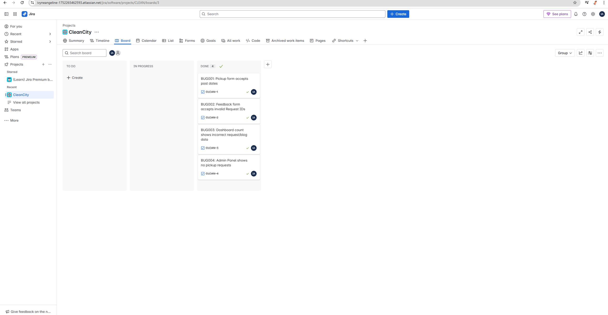

# ✅ Week 2 Progress Report - CleanCity QA Testing

## ✅ Progress
- Manual test cases executed on key areas: pickup, feedback, dashboard, admin.
- Bug log created based on real observed issues.
- Signup flow vulnerability identified and logged.
- All bugs and test cases were logged and tracked using a Jira Kanban board.

## ⚠️ Challenges
- Past dates not blocked in pickup form
- Feedback form lacks Request ID validation
- Dashboard data not reflected correctly despite form submission
- Admin panel shows no requests for status updates
- Dashboard shows zero for Total Requests and Blog Posts even after test data

## 👥 Contributions
- **Angeline Ivene**: Pickup form validation, auth flaw
- **Angeline Ivene**: Admin and dashboard issues
- **Angeline**: Feedback ID validation, dashboard count

## 🔜 Next Steps
- Continue automation setup using Jest
- Validate localStorage handling and data persistence
- Prepare for UI accessibility testing and mobile responsiveness (Week 3)

---

## 📋 Test Case Execution Summary

| TC     | Test Case                               | Priority | Status                   | Module        |
|--------|------------------------------------------|----------|--------------------------|----------------|
| TC01   | Pickup form validation & filtering       | High     | Executed (Partially Failed) | Waste Request  |
| TC02   | Feedback form error handling             | Medium   | Executed (Failed)           | Feedback       |
| TC03   | Dashboard counts not updating            | High     | Executed (Failed)           | Dashboard      |
| TC04   | Admin: Status update                     | High     | Blocked                     | Admin Panel    |

---

### ✅ Summary of Test Case Findings

#### TC01: Pickup Form – Validate Required Fields & Filter Logic
- **Expected:** Required fields must throw errors, past dates should be blocked.
- **Actual:** Field validation works ✅, but **past dates are accepted ❌**
- **Location dropdown:** Works as expected ✅

#### TC02: Feedback form accepts any ID
- **Expected:** Should reject unknown or fake Request IDs
- **Actual:** Submits feedback even for `REQ999` ❌

#### TC03: Dashboard Request and Blog Count Validation
- **Expected:** Total requests, blog posts, and missed pickups should reflect test data
- **Actual:** All show **zero ❌** even after submitting form. Only **Community Posts = 3 ✅**

#### TC04: Admin Panel - Status Update Blocked
- **Expected:** Should update request status from Admin
- **Actual:** Admin panel has **no data** to update ❌

---

## 🧾 Jira Issue Tracking Summary

We used a Jira Kanban board to track all bugs and test cases. Each issue was categorized and progressed through **To Do → In Progress → Done**.

## 🧾 Jira Issue Tracking Summary

We used a Jira Kanban board to track core bugs and test cases for Week 2. Each issue was progressed through **To Do → In Progress → Done** based on test execution.

| Ticket Key | Type     | Summary                                     | Status  | Priority | Assigned To     |
|------------|----------|---------------------------------------------|---------|----------|------------------|
| BUG-001    | Bug      | Past date accepted in pickup form           | Done    | High     | Angeline Ivene   |
| BUG-002    | Bug      | Feedback form accepts any Request ID        | Done    | Medium   | Angeline Ivene   |
| BUG-003    | Bug      | Dashboard counts do not reflect submission  | Done    | High     | Angeline Ivene   |
| BUG-004    | Bug      | Admin panel shows no data to schedule       | Done    | High     | Angeline Ivene   |

[GitHub Issues Link](https://github.com/IvyneAngeline/CleanCity/issues)

## 📌 Jira Evidence (Board Snapshot + Link)

- ✅ All test activities were tracked using a **Jira Kanban Board**.
- 🔗 **Board Link:** [Jira Project - CLEANCITY](https://ivyneangeline-1752265462593.atlassian.net/jira/software/projects/CLEAN/boards/3)
- 🧷 Columns Used: `To Do`, `In Progress`, and `Done`
