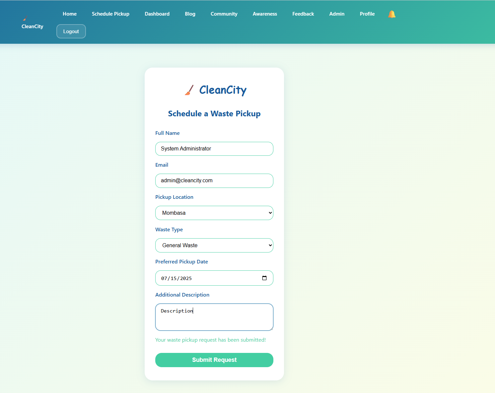
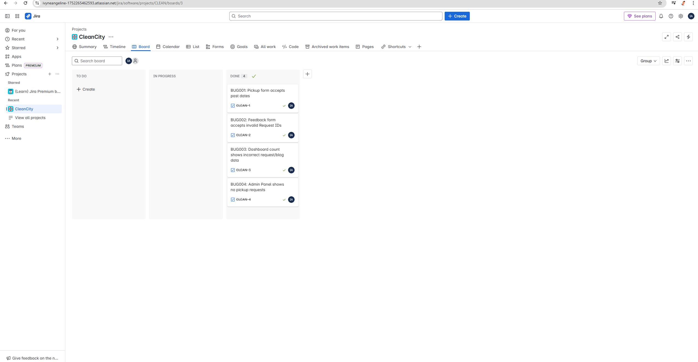
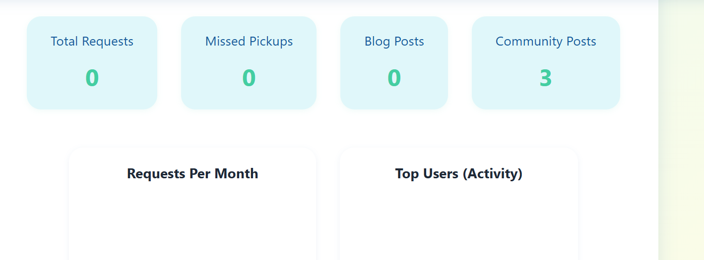
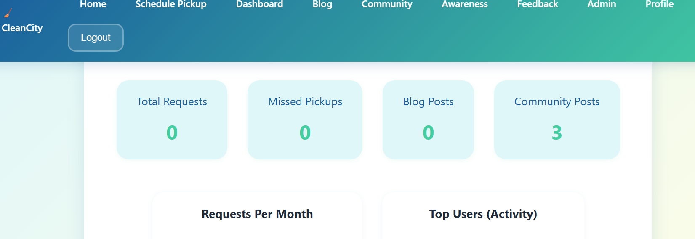

# ✅ Week 3 - CleanCity QA Testing Report

## 📌 Summary
This week focused on executing more manual test cases and tracking bugs in Jira. We validated real system behaviors and added screenshots to support findings.

## ✅ Work Completed
- Ran manual tests for feedback, pickup, dashboard, and admin modules.
- Logged bugs into Jira Kanban board and updated statuses.
- Linked screenshots as evidence for reported issues.
- Updated test cases for real environment observations.
- Created a summarized Jira tracking table.

## ⚠️ Challenges Observed
- Admin panel lacked data, blocking status update testing.
- Dashboard still did not reflect actual request count.
- Feedback form accepts invalid Request IDs.
- Validation flaw allowed past dates to be submitted.

## 📸 Jira Bug Tracking (Logged)

| Ticket Summary                          | Status   | Screenshot Evidence |
|----------------------------------------|----------|----------------------|
| Past date accepted in pickup form      | Done     |    |
| Feedback form accepts any Request ID   | Done     |     |
| Dashboard counts remain at zero        | Done     |     |
| Admin status update test blocked       | Done     |      |

> All issues were logged, moved across To Do → In Progress → Done columns and tracked on the team Jira Kanban board.

## 🧪 Test Execution Summary

| TC ID | Description                                  | Result        |
|-------|----------------------------------------------|---------------|
| TC01  | Pickup form – required fields & past dates   | Partially Fail |
| TC02  | Feedback form – accepts any ID               | Fail          |
| TC03  | Dashboard counts update                      | Fail          |
| TC04  | Admin panel – no requests available          | Blocked       |

## 👥 Team Contributions
- **Angeline Ivene**: Pickup and feedback testing, bug reporting
- **Angeline Ivene**: Dashboard behavior testing and screenshots
- **Angeline Ivene**: Admin module observation, test script updates

## 🔗 Jira Board
- Jira Project: CLEAN
- Board: https://ivyneangeline-1752265462593.atlassian.net/jira/software/projects/CLEAN/boards/3

## ✅ Next Steps
- Start working on final PDF report and 5-minute video summary
- Confirm submission on Google Drive before deadline
- Email links along with team name for review

